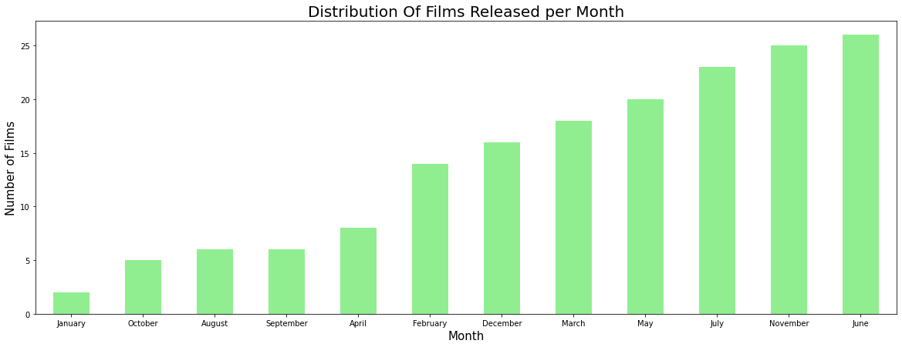
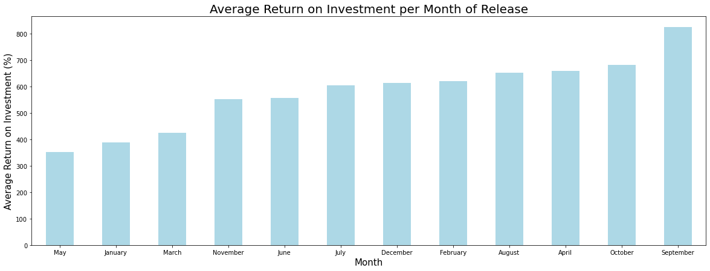
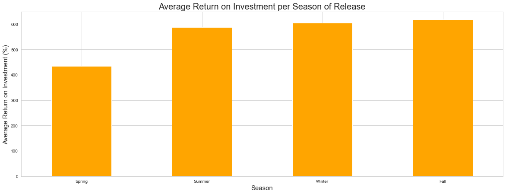
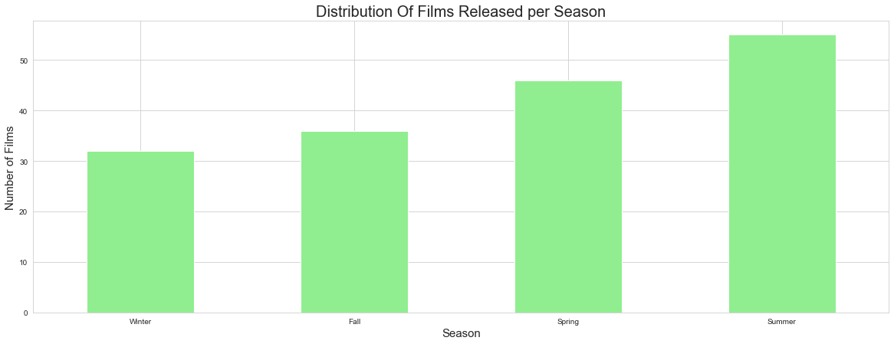
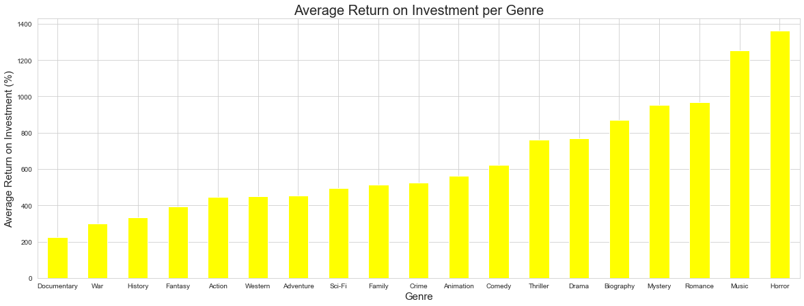
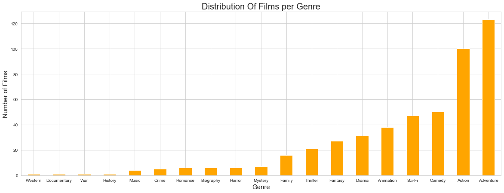
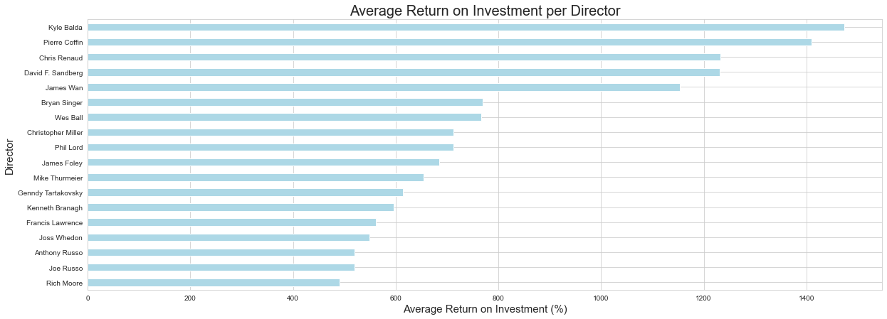
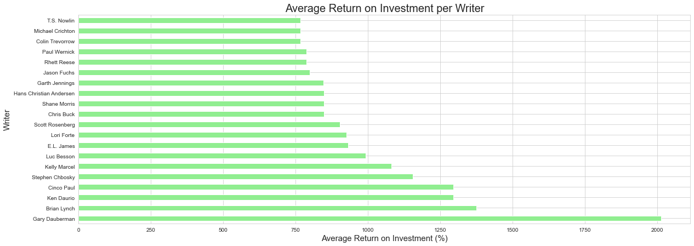
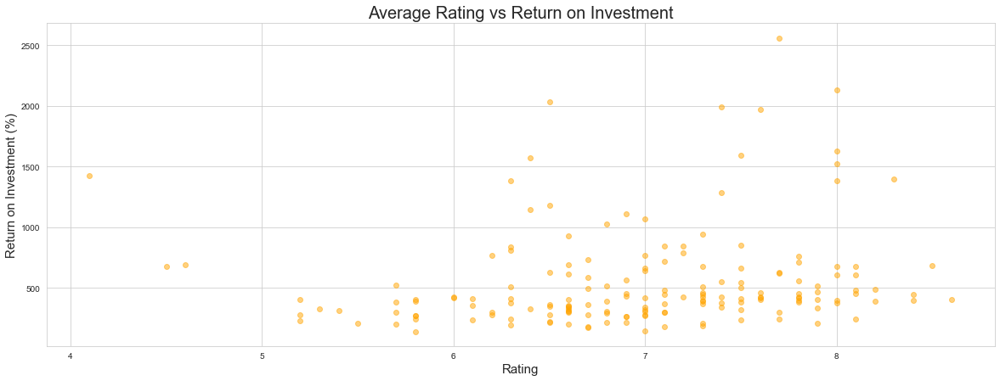

# **Microsoft Movie Studio EDA** ([Femi Kamau](https://github.com/ctrl-Karugu))

> This project is a part of the [Data Science (DSF-FT) Course](https://moringaschool.com/courses/data-science-course/) at [Moringa School](https://moringaschool.com/). The full project description can be found [here](https://github.com/learn-co-curriculum/dsc-phase-1-project-v2-4).

---
---

## Overview

* Following the creation of movie studio, we have been tasked by Microsoft, who have no idea about making films, to identify what makes a film perform well at the box office. After identifying return on investment (RoI) as the primary metric of success, we narrowed down the datasets provided to the top 200 most grossing movies worldwide then calculated the RoI for each. After plotting several scatter and bar plots comparing runtime, production budget, gross revenue, release date, genre, directors, writers, and rating, the analysis identified the following:
  * The best time to release a film is during Summer.
  * Films directed by Kyle Balda, Pierre Coffin, Chris Rennaud, David F. Sandberg, and James Wan perform the best, whereas those Gary Dauberman were the most successful of all the other writers. 
  * Lastly we that length of a film, gross revenue and rating, and have no impact on the RoI of a film.

---

### 1. Business Problem

* Microsoft has decided to enter the original video content scene by creating a new movie studio. However, they don't know anything about creating movies. In order to solve this problem, the analysis shall be centered around answering the following question:

   > #### What types of films are currently performing the best at the box office?

* According to this [Holywood Reporter](https://www.hollywoodreporter.com/movies/movie-news/what-is-profitable-movie-ever-1269879/) article, we see that the metric used to determine performance of a movie at the box office may vary. Therefore, it is important to clarify that within this analysis, **the metric that shall be used to determine the success of a movie will be based on the return on investment (RoI) of the highest grossing films**. ROI is an important performance measure used by businesses to evaluate the profitability of an investment or compare the efficiency of a number of different investments.

* In order to further understand the types of movies that are currently performing the best at the box office, this analysis will look into the impact following features have on the ROI:

  * Runtime

  * Production Budget

  * Gross Revenue

  * Release Date

  * Genre

  * Directors

  * Writers

  * Rating

---

### 2. Data Understanding

* This analysis uses [datasets](./data/) obtained from two renowned movie websites:

  1. [The Numbers](https://www.the-numbers.com/) - `tn.movie_budgets.csv.gz`

  2. [IMDB](https://www.imdb.com/) - `im.db.zip`

* From the [first dataset](data/tn.movie_budgets.csv.gz) which is in `.csv` format, we have the names, release dates, and monetary information of films that have been released and those are are yet to be released.With RoI being the target variable, the monetary data (production budget and worldwide gross) columns are the main reason this dataset was selected. Furthermore, the movie title and release date columns make this dataset an all round good starting point for the data preparation stage.

* From the [second dataset](data/im.db.zip) which is in `.db` format, we have database with 8 tables containing different types of non-monetary information about films such as their directors, writers, and genres, and the ratings and [more](images/imdb_data_erd.jpeg). This information will be used to understand the characteristics of the films that are currently performing the best at the box office.

---

### 3. Methods

* The process used to analyze the data in this project is as follows:

  1. Narrow the [first dataset](data/tn.movie_budgets.csv.gz) down to the movies that have been released within the past ten years using the 'release_date' column. This is because we are looking for films that are **currently** performing the best.

  2. Sort the DataFrame by the worldwide gross column in descending order and slice the first 200 rows. We shall be analysing the RoI based on the highest grossing films. Furthermore, narrowing the DataFrame to the top 200 records will ensure that the films selected have a gross that is around $300 million or more. This is a good worldwide gross for a film.

  3. Create a new column in the DataFrame to store the RoI value that will be calculated by dividing the worldwide gross by the production budget and multiplying the result by 100 to represent the percentage.

  4. Add more one-to-one features that will be used to classify the data. These feautres that we are looking to analyze are:

       * Runtime
  
       * Genres

       * Rating
  
      These features can be obtained by joining the `movie_basics` table by using the 'primary_title' column and `movie_ratings` table using the newly joined 'movie_id' column.

  5. Clean the data by dropping the rows that have been joined to the wrong movie from the imdb datasets and those containing missing values.
     * By evaluating the year values from the the 'release_date' column and the 'start_year' column that was joined from the `movie_basics` table, we can determine the records that have discrepancies and drop them.
     * Drop the films that contain duplicate movie titles. Though it is possible for two multiple films to share a title, it is not a good idea to include them in the analysis as there is no way of verifying whether or not the information is correct.
  
  6. The last step would be to drop the columns that do not contain variables that we are interested in. These are: 'id', 'domestic_gross', 'primary_title', 'start_year', 'release_year', and 'numvotes'.

* After performing this analysis we ended up with a DataFrame containing the following columns:

  1. 'movie_id' - The unique identifier for each movie from the imdb dataset.
  
  2. 'release_date' - The release date of the film.
  
  3. 'movie' - The title of the film.

  4. 'production_budget' - The production budget of the film.

  5. 'worldwide_gross' - The worldwide gross of the film.
  
  6. 'RoI' - The return on investment of the film.
  
  7. 'runtime_minutes' - The length of the film in minutes.

  8. 'genres' - The genres of the film.
  
  9. 'averagerating' - The average rating of the film.

  The approach chosen to prepare the data is appropriate as it enables for the analysis of the target variable (RoI) against the non-monetary features making it easier to get insights.

  The other features such as 'directors', 'writers' will be implented in the in analysis phase in separeate DataFrames each since they contain one-to-many relationships. That would have made the analysis more difficult.

---

### 4. Results

* For the analysis phase we chose our primary target variable, RoI, and analyzed the rest of the featues against it:

  1. **Runtime** - The goal was to identify the whether the length of a film has any impact on the return on investment. After plotting the [scatter plot](images/runtime_vs_roi.png) of the runtime against the RoI, we see that runtime has not direct impact on the return on investment of a film. This coupled with the Pearson correlation coefficient of -0.1 which closer to 0, indicating that the runtime does not have any impact on the return on investment of a film. 

  2. **Production Budget** - The aim of this analysis was to identify whether spending more money on the production a film results in a higher return on investment. From the [scatter plot](images/production_budget_vs_roi.png) used, we see that there is a negative correlation between the production budget and the RoI. However, this relationship is not linear. From 0 to 100 million dollars, the correlation is negative. However, from 100 to 300 million dollars, there is no distict correlation between the return on investment and the production budget. Looking at the Pearson correlation coefficient, we see that the correlation coefficient (-0.6) suggests a moderately negative relationship between the return on investment and the production budget which confirms what we see on the scatter plot. Therefore, the more the money spent on the production of a film, the return on investment generally less. 
  
  3. **Worldwide Gross** - The aim of this analysis was to identify whether there is a relationship between films the gross the highest and the return on investment. From the [scatter plot](images/worldwide_gross_vs_roI.png) used, there is no distinct relationship between the worldwide gross and the RoI. Looking at the Pearson correlation coefficient, we see that the correlation coefficient (0.15) is closer to 0 therefore suggesting that the worldwide gross of a film has no impact on its RoI. 

  4. **Release Date** - The aim of this analysis was to identify the impact that time of release has on the return on investment of a film. This analysis was split into parts: Month and Season. The analysis by month showed that films released in September averagely yield a higher RoI, however, after looking at the film distribution, we see that the distribution was not even and may perhaps be the reason as to why September which had fewer films than most avereaged a higher RoI.    The analysis per season shows that the highest return on investment is achieved in the Fall season, however, since the Fall season had the lowest number of films, we see that it isn't an accurate season to consider. When we look at the Summer season though, we see that it had a comparable RoI to the Fall season despite having the most films released. This therefore suggests that films released in the Summer are the best performing.  


  5. **Genres** - The aim of this analysis was to identify the genre that produces the highest RoI. From the barplot used, we see that the genre that produces the highest RoI is Horror followed by Music. However, when we look at the number of films per genre, we can see that the distribution of the genre of films in the dataset is not even. Therefore, we need to take this into account that the reason that the 'Horror' and 'Music' genre have a higher average return on investment may be because there are fewer films classified under them. It is however important to note that of the Top 200 Highest Grossing Films that were originally selected, majority of were Adventure and Action. This suggests that Adventure and Action films averagely make the most money. As a result, this makes it difficult to derive any definate conclusion as to what genre yields the highest average RoI.  

  6. **Directors** - The aim of this analysis was to identify the directors with the highest average RoI for the films that they have directed. We only focused on the directors who had multiple films within the prepared dataset. From the [plot](images/avg_roi_per_director.png), we can see that films directed by Kyle Balda, Pierre Coffin, Chris Rennaud, David F. Sandberg, and James Wan produced the highest return on investment 

  7. **Writers** - The aim of this analysis was to identify the writers with the highest average RoI for the films that they have written. We only focused on the writers who have written multiple films within the prepared dataset. From our [plot](images/avg_roi_per_writer.png) we can see that films written by Gary Dauberman produced the highest return on investment.

  8. **Rating** - The aim of this final analysis was to identify the impact that return on investment has on the rating of a film. From the [scatter plot](images/rating_vs_roi.png), it is difficult to see any distinct relationship between the rating and the RoI. However, looking at the Pearson correlation coefficient (0.15), we see that it is closer to 0 therefore confirming that there is indeed no relationship between the rating of a film and the RoI. 

---

### 5. Conclusions

* This analysis leads to the following recommendations for the types of films that are the best performing in the box office:

  1. **The length of a film (Runtime) of a film has no impact on its box ofice performance.**

  2. **The Production Budget of a film has a modereately negative correlation with its return on investment.**

  3. **The Worldwide Gross of a film has no impact on its return on investment.**
  
  4. **Movies released in the Summer are more likely to yield a higher return on investment**. Though September (Fall) had the highest average return on investment, the number of films released was significantly less than other months. Therefore, it would not have been an accurate measure to determine the optimal time to release a film.
  
  5. **'Horror' and 'Music' genres are more likely to have a higher return on investment.**. It is however important to note that 'Action' and 'Adventure' films are the top most grossing.
  
  6. **Films directed by Kyle Balda, Pierre Coffin, Chris Rennaud, David F. Sandberg, and James Wan produce the highest return on investment.**
  
  7. **Films written by Gary Dauberman produce the highest return on investment.**
  
  8. **Success of a film is not determinant on the films rating**

* This analysis may not fully solve the business problem because there are other factors which affect the performace of a film such from data that was not available during for this analysis (for example, the amount of money that is spent for the film's marketing), as well as other unpredictable circumstances going on in the world (pandemics, economic downturns, war, etc).

* In order to further improve this analysis, we would need to look at more financial data such as the amount of money that is spent for the marketing, social impact of the films as well as the main cast of the films.

---
---

## Repository Structure

* The repository is structured as follows:

```
├── README.md                            <- The top-level README for reviewers of this project
├── index.ipynb                          <- Narrative documentation of analysis in Jupyter Notebook
└── data                                 <- Datasets used in the analysis
|    ├── tn.movie_budgets.csv.gz
|    └── im.db.zip
|
└── images                               <- Images sourced externally and from the code
   

```

---

## For More Information

* Please review the full analysis in the [Jupyter Notebook](./index.ipynb) or the [Presentation](./presentation.pdf). (Update presentation link)

* For any additional questions, please contact **[Femi Kamau](mailto:femikkamau@gmail.com)**

---
---

>## *“Patience is a key element of success.”* - Bill Gates
